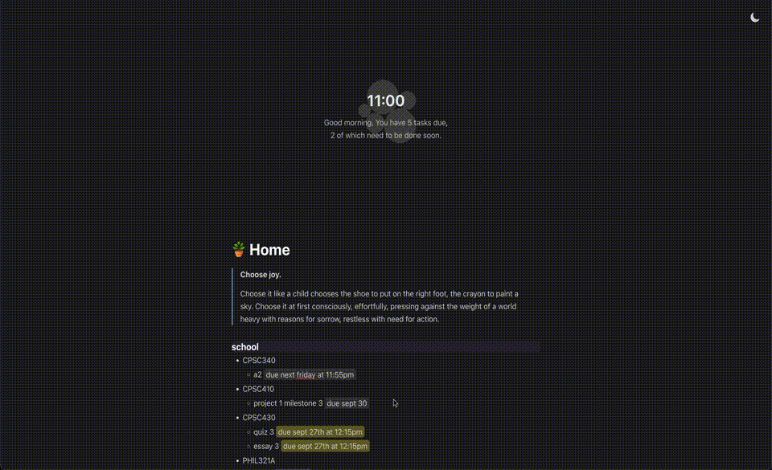

= Tab␣
:product-url: https://tabspace.jzhao.xyz/index.html

=== A scratchspace for your new Tab

A beautiful new tab replacement that gives you your very own 
scratch space to help you stay organized and focused.

It features a prominent spatial visualization for all of your 
tasks that helps you prioritize what's important, auto-saving notes, 
rich text formatting and natural language due dates.

== Features
- Auto-saves to local storage
- Write in Markdown syntax
- Uses natural language to recognize and highlight due dates
- Darkmode

== Usage
To set tabspace as your new tab page, depending on your browser can either set up the project as a
browser extension that replaces the new tab page or configure your new tab page
URL to point to the official tabspace website: {product-url}

=== Building the browser extension locally
. Clone the repository
. Install dependencies `npm i`
. Build `npm run build`
. Load the extension in the Chrome Extensions menu
.. Go to extensions > Enable developer mode (top right corner)
.. Click load unpacked, select the `build` folder

For more information, see the https://developer.chrome.com/docs/extensions/mv3/getstarted/[official
documentation].

=== Setting up the website as your new tab page
Based on your browser, there may be an option to set the new tab page URL
directly without installing an extension.

==== Brave
. Go to `brave://settings/?search=home` and make sure _Show Home button_ is
  enabled
. Set the homepage to:
+
[source,subs=attributes+]
----
{product-url}
----
. Scroll down and set the _New tab page shows_ option to _Homepage_
. (If you don't want the home button, you can safely disable the previous option
  now)

For reference, see https://community.brave.com/t/specifying-the-website-of-a-new-tab/195724/3[this forum answer].
